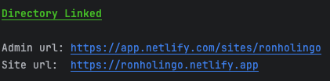

# Ronholingo

**Ronholingo** est un site web gratuit, interactif et amusant pour l'apprentissage du vocabulaire en anglais, français, espagnol, allemand, italien, japonais et vietnamien.

Le site est déployé sur Netlify. Vous pouvez le visiter via le lien ci-dessous :

**Lien vers le site web :** [https://ronholingo.netlify.app/](https://ronholingo.netlify.app/)

Vous pouvez tester l'application. Si vous souhaitez contribuer et ajouter des fonctionnalités, suivez les instructions ci-dessous :

### Étapes pour contribuer :

1. **Cloner le projet.**
2. **Installer les dépendances** avec la commande `npm install`.
3. **Configuration des clés API OpenAI :**
    - Les clés API d'OpenAI sont définies comme des variables d'environnement sur Netlify et ne sont pas disponibles directement. Elles sont payantes, car l'utilisation est facturée en fonction des modèles et des tokens envoyés ou reçus par requête.
    - Pour travailler sur le projet en local et accéder à la clé, vous devez configurer Netlify CLI comme suit :
        - **Netlify CLI** est déjà inclus dans le `package.json`, donc une fois les dépendances installées, Netlify CLI sera également disponible.
        - **Connexion à Netlify :** Connectez-vous à votre compte Netlify via la CLI avec la commande : `netlify login`.
        - **Lier Netlify CLI au site :** Pour obtenir l'ID du site, contactez-nous à l'une des adresses suivantes : Cristhian (cristhian.roquillo@heig-vd.ch) ou Julien (julien.holzer@heig-vd.ch). Des vérifications seront effectuées avant de vous fournir l'ID du site, car la clé API est affichée dans le terminal à chaque requête.
        - Une fois l'ID du site reçu, exécutez la commande suivante : `netlify link`.
        - Lorsque la commande est exécutée, sélectionnez **"Enter a site ID"** et collez l'ID fourni.
        - Si l'ID est correct, le message suivant s'affichera :  
          
        - **Pour déployer le site en local, utilisez la commande :** `netlify dev`. Cela vous permettra d'accéder à la clé. Pour l'utiliser dans votre code, référez-vous à `process.env.OPEN_AI_KEY`. Un exemple est disponible dans les fichiers du répertoire `./functions`.
4. **Si vous travaillez uniquement sur le front-end**, il n'est pas nécessaire de suivre l'étape 3 saut si vous voulez déployé le site en local.
5. **Travailler sur la branche `dev`** et créer une **pull request** vers la branche `main` afin que nous puissions vérifier votre code avant de le fusionner avec la branche principale. Un pipeline est configuré pour déployer automatiquement sur Netlify après chaque push sur `main`.
6. **Pour exécuter les tests en local**, utilisez la commande `npm test`. Un script est déjà configuré pour exécuter tous les tests.
7. **Si vous ajoutez des tests**, placez-les dans le dossier `./tests` et nommez les fichiers de la manière suivante : `nomDuFichier.test.js`.

